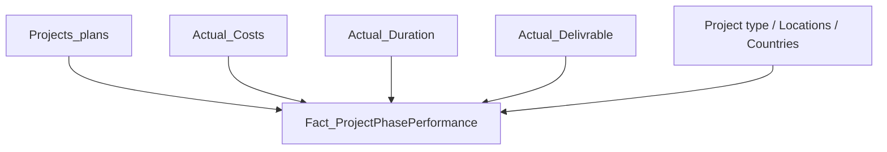

# Modele de donnees

Ce document decrit le modele de donnees cible pour le rapport Power BI Sanitoral.

## Objectif du modele

Le modele doit permettre d'analyser les performances des projets Sanitoral selon plusieurs axes :

- projet ;
- type de projet ;
- phase ;
- pays ;
- region ;
- date ;
- couts ;
- durees ;
- livrables ;
- alertes.

## Grain d'analyse

Le grain principal est la phase d'un projet.

Chaque ligne represente donc :

```text
1 projet + 1 phase
```

La cle logique est :

```text
ProjectPhaseKey = Project_ID + Phase
```

## Tables sources

| Table | Description |
|---|---|
| `Projects_plans` | Donnees prevues par projet et phase |
| `Actual_Costs` | Couts reels par projet et phase |
| `Actual_Duration` | Durees reelles par projet et phase |
| `Actual_Delivrable` | Livrables reels par projet et phase |
| `Project type` | Type de projet |
| `Projects_Locations` | Pays de chaque projet |
| `Country_Profiles` | Region et type de pays |

## Modele recommande

Modele simple et explicable :



La table centrale `Fact_ProjectPhasePerformance` contient les informations prevues, reelles et les colonnes d'alerte.

## Colonnes principales de la table centrale

| Colonne | Role |
|---|---|
| `Project_ID` | Identifiant du projet |
| `ProjectPhaseKey` | Cle unique projet-phase |
| `Project_Type` | Type de projet |
| `Phase` | Phase du projet |
| `Start Date` | Date de debut de la phase |
| `Country` | Pays |
| `Region` | Region |
| `Type` | Type d'entite locale |
| `Planned_Cost` | Cout prevu |
| `Actual_Cost` | Cout reel |
| `Planned_Duration` | Duree prevue |
| `Actual_Duration` | Duree reelle |
| `Planned_Deliverables` | Livrables prevus |
| `Actual_Deliverables` | Livrables reels |
| `Alert_Cost` | Alerte cout |
| `Alert_Duration` | Alerte duree |
| `Alert_Deliverables` | Alerte livrables |
| `Any_Alert` | Alerte globale |

## Dimensions possibles

Pour aller plus loin, le modele peut etre organise en etoile :

- `Dim_Project`
- `Dim_ProjectType`
- `Dim_Phase`
- `Dim_Country`
- `Dim_Region`
- `Dim_Date`
- `Fact_ProjectPhasePerformance`

Cette approche est plus propre pour un usage professionnel, mais le modele doit rester lisible et facile a presenter.

## Regles de relation

Relations principales :

- `Project_ID` relie les projets a leur type et leur pays ;
- `Country` relie les projets aux regions ;
- `ProjectPhaseKey` relie les donnees prevues aux donnees reelles ;
- `Start Date` peut etre reliee a une table calendrier.

## Points de vigilance

- `Phase` seule ne doit pas etre utilisee comme cle unique.
- `Project_ID` seul ne suffit pas pour relier les couts, durees et livrables au niveau phase.
- Les noms de pays doivent etre verifies pour la carte Power BI.
- Les relations doivent rester a sens de filtrage simple lorsque c'est possible.

